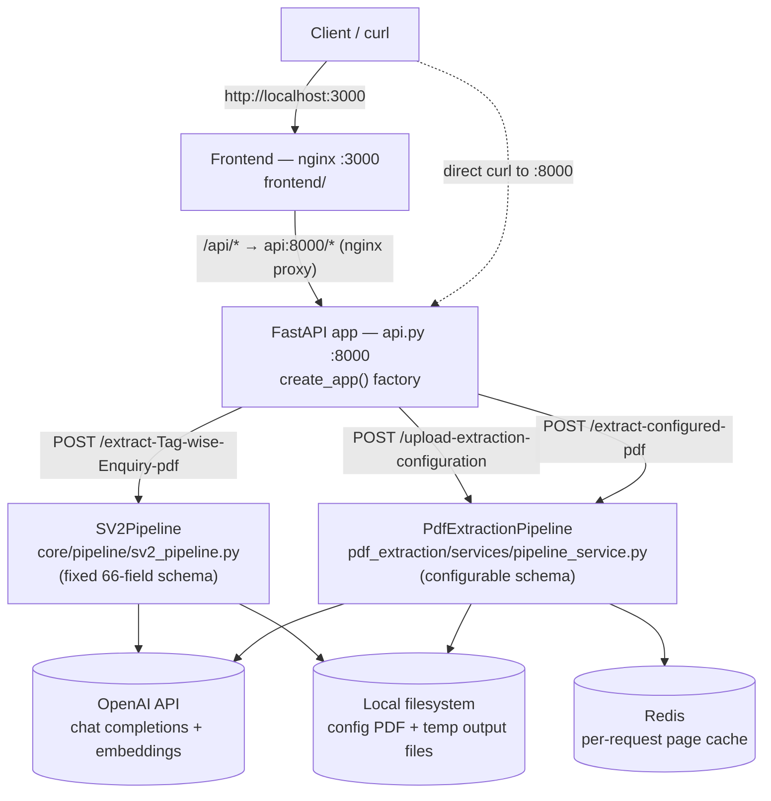
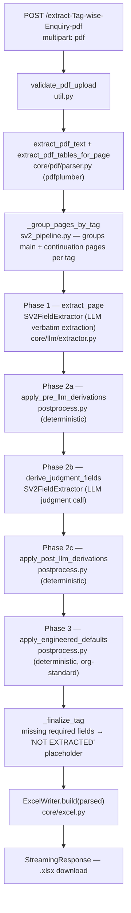
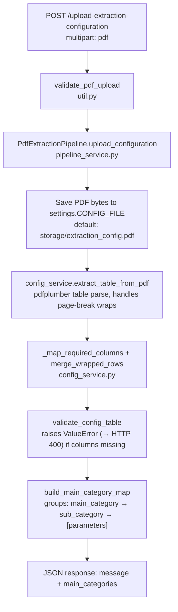
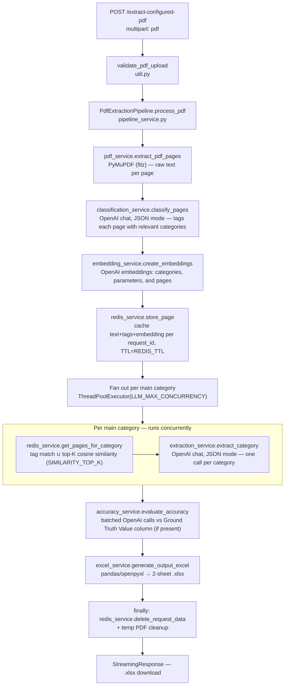

# poc-valves — PDF Valve Datasheet Extraction Service

A FastAPI service that extracts structured valve-datasheet data from PDF documents and returns it as an Excel workbook. It supports two extraction modes:

- **Fixed SV2 schema** — a built-in 66-field valve datasheet schema (tag number, process conditions, materials, etc.), extracted via a three-phase LLM pipeline.
- **User-configurable schema** — you upload a "configuration" PDF describing whatever fields you want extracted (with optional ground-truth values for accuracy scoring), then run any number of documents against that configuration.

A static frontend (nginx-served single-page app) and a standalone CLI tool for a third extraction use case (field-mapping registers) are also included.

## Architecture overview



All three endpoints are `POST`, accept `multipart/form-data` with a single `pdf` field, and return either an `.xlsx` file (`StreamingResponse`) or a small JSON status object. There's no auth, no routers/sub-apps — all three routes are declared directly on one `FastAPI()` instance in `src/poc_valves/api.py`, with CORS wide open (`allow_origins=["*"]`). Route handlers only validate the upload and build the HTTP response; all business logic lives in `src/poc_valves/util.py`.

## Endpoints

### 1. `POST /extract-Tag-wise-Enquiry-pdf`

Extracts the fixed 66-field SV2 valve datasheet schema from a PDF and returns one Excel row per tag found.

- **Handler:** `sv2_extract` (`src/poc_valves/api.py:29`) → `util.run_sv2_extraction` (`src/poc_valves/util.py:62`)
- **Request:** `pdf: UploadFile` (multipart)
- **Response:** `.xlsx` download, `Content-Disposition: attachment`



Pages are matched to a tag with two regexes (`sv2_pipeline.py`): a main datasheet page starts with `1 Tag No.`, continuation pages (process notes, MDMT, IBR applicability, etc.) start with `Tag Number:`. Each tag's pages are merged and processed in one call per phase; a tag missing required fields after all three phases still produces a row (marked `NOT EXTRACTED`) rather than failing the whole request.

**Relevant config:** `config/settings.yml` (`llm.model`, `llm.temperature`, `postprocessing.use_engineered_defaults`), `config/prompts.yml` (extraction prompts), `config/reference.yml` (the 66-field registry). Env overrides: `OPENAI_MODEL`, `OPENAI_TEMPERATURE`, `OPENAI_PROMPT_COST_PER_1K`, `OPENAI_COMPLETION_COST_PER_1K`, `OPENAI_USD_TO_INR_RATE`, `POSTPROCESSING_USE_ENGINEERED_DEFAULTS`.

### 2. `POST /upload-extraction-configuration`

Uploads a "configuration" PDF — a table defining which fields to extract, grouped into categories — for use by `/extract-configured-pdf`. Must be called before that endpoint; each upload replaces the previously stored configuration.

- **Handler:** `upload_extraction_configuration` (`src/poc_valves/api.py:44`) → `util.run_upload_extraction_configuration` (`src/poc_valves/util.py:145`)
- **Request:** `pdf: UploadFile` (multipart)
- **Response:** `{"message": ..., "main_categories": [...]}`



The configuration table must include columns for `Ext. ID`, `Category`, `Parameter / Field to Extract`, `Extraction Guidance`, `Typical Clause Keywords`, `Data Type`, `Unit / Allowed Values`, `Priority`, `Target MIL DS Field`, and optionally `Ground Truth Value` (enables accuracy scoring in step 3 below).

### 3. `POST /extract-configured-pdf`

Runs a document PDF through the extraction schema uploaded via endpoint 2, and returns extracted values (plus an accuracy sheet if ground-truth values were provided).

- **Handler:** `extract_configured_pdf` (`src/poc_valves/api.py:53`) → `util.run_extract_configured_document` (`src/poc_valves/util.py:168`)
- **Request:** `pdf: UploadFile` (multipart)
- **Response:** `.xlsx` download (two sheets: "Extraction Results", "Accuracy Summary")
- **Precondition:** returns HTTP 400 if no configuration has been uploaded yet



Per-parameter page hints (`PARAMETER_HINT_TOP_N`) are computed alongside category-level retrieval to point the LLM at the most likely source pages for each field. Accuracy scoring classifies each field as `match` / `partial_match` / `mismatch` / `not_applicable` and is skipped entirely if the configuration has no `Ground Truth Value` column. All Redis-cached page data for the request is deleted at the end regardless of success or failure.

**Relevant config** (`src/poc_valves/pdf_extraction/core/config.py`): `OPENAI_CHAT_MODEL`, `OPENAI_EMBEDDING_MODEL`, `REDIS_HOST`/`REDIS_PORT`/`REDIS_DB`/`REDIS_TTL`, `CONFIG_FILE`, `SIMILARITY_TOP_K`, `SIMILARITY_FLOOR`, `PARAMETER_HINT_TOP_N`, `ACCURACY_BATCH_SIZE`, `LLM_MAX_CONCURRENCY`.

## Configuration

| Setting | Where | Default | Purpose |
|---|---|---|---|
| `OPENAI_API_KEY` | `.env` | — (required) | OpenAI auth, used by both pipelines |
| `OPENAI_MODEL` | `.env` / `config/settings.yml` | `gpt-4.1-mini-2025-04-14` | SV2 pipeline chat model |
| `OPENAI_TEMPERATURE` | `.env` / `config/settings.yml` | `0.01` | SV2 pipeline sampling temperature |
| `POSTPROCESSING_USE_ENGINEERED_DEFAULTS` | `.env` / `config/settings.yml` | `false` | Apply org-standard defaults for "Engineered" fields (SV2 pipeline) |
| `OPENAI_CHAT_MODEL` | `.env` | `gpt-4.1-mini` | Configurable pipeline: classification, extraction, accuracy calls |
| `OPENAI_EMBEDDING_MODEL` | `.env` | `text-embedding-3-small` | Configurable pipeline: category/parameter/page embeddings |
| `REDIS_HOST` / `REDIS_PORT` / `REDIS_DB` | `.env` | `localhost` / `6379` / `0` | Redis connection for the configurable pipeline's page cache |
| `REDIS_TTL` | `.env` | `3600` | Seconds a cached page survives in Redis |
| `CONFIG_FILE` | `.env` | `storage/extraction_config.pdf` | Where the uploaded configuration PDF is persisted between calls |
| `SIMILARITY_TOP_K` | `.env` | `10` | Top-K pages retrieved by cosine similarity per category |
| `SIMILARITY_FLOOR` | `.env` | `0.15` | Similarity floor to drop clearly irrelevant pages |
| `PARAMETER_HINT_TOP_N` | `.env` | `3` | "Likely pages" hints surfaced per field in the extraction prompt |
| `ACCURACY_BATCH_SIZE` | `.env` | `25` | Ext-ID comparisons per accuracy-evaluation LLM call |
| `LLM_MAX_CONCURRENCY` | `.env` | `5` | Max concurrent LLM calls for per-category extraction/accuracy scoring |

Other config files:
- `config/settings.yml` — SV2 pipeline app settings (see table above); YAML values are overridden by the matching env var if set.
- `config/prompts.yml` — SV2 pipeline LLM prompt templates.
- `config/reference.yml` — the 66-field SV2 field registry used by the SV2 pipeline.

> **Note:** keep real secrets only in a local, gitignored `.env` — never commit an actual `OPENAI_API_KEY` value to the repo.

## Setup & running

**Locally, with [uv](https://docs.astral.sh/uv/):**

```bash
uv sync
cp .env.example .env   # then fill in OPENAI_API_KEY (create this file if it doesn't exist yet)
uv run uvicorn poc_valves.api:create_app --factory --reload
```

The API listens on `http://localhost:8000`. Redis is required for `/extract-configured-pdf` — run one locally (`redis-server` or `docker run -p 6379:6379 redis:7-alpine`) or use `docker compose` below.

**With Docker Compose** (API + Redis + frontend):

```bash
docker compose up --build
```

- API: `http://localhost:8000`
- Frontend: `http://localhost:3000` (nginx proxies `/api/*` to the API container)
- Redis: `localhost:6379`

**Example requests:**

```bash
curl -X POST "http://localhost:8000/extract-Tag-wise-Enquiry-pdf" \
  -F "pdf=@/path/to/enquiry.pdf" -OJ

curl -X POST "http://localhost:8000/upload-extraction-configuration" \
  -F "pdf=@/path/to/configuration.pdf"

curl -X POST "http://localhost:8000/extract-configured-pdf" \
  -F "pdf=@/path/to/document.pdf" -OJ
```

## Frontend

`frontend/` is a static HTML/JS/CSS single-page app served by nginx (`frontend/Dockerfile`, `frontend/nginx.conf`). It calls the three endpoints above under an `/api/` prefix, which nginx strips and proxies to the API container (`proxy_pass http://api:8000/`). Run it via `docker compose up --build` (see above); it isn't set up to run standalone against a non-Docker API without adjusting `frontend/nginx.conf`.

## Standalone CLI tool: field mapping register

`src/poc_valves/field_mapping_register/` is a separate tool (not wired into the FastAPI app) that reconstructs rows from a PDF's field-mapping register via OpenAI and writes an Excel file. It has no installed console-script entry point (no `[project.scripts]` in `pyproject.toml`), so invoke its `main()` directly:

```bash
export OPENAI_API_KEY=your_key_here
uv run python -c "
from poc_valves.field_mapping_register.runner import main
raise SystemExit(main(['--pdf', 'path/to/register.pdf', '--output', 'field_mapping_register.xlsx']))
"
```

CLI options (see `runner.py:build_parser`): `--pdf` (required), `--output` (default `field_mapping_register.xlsx`), `--pages-per-chunk` (default `2`), `--preview-only` (print a preview and stop before writing Excel), `--model` (overrides `OPENAI_MODEL`, default `gpt-4.1`).

## Project structure

```
src/poc_valves/
├── api.py                      # FastAPI app + the 3 routes
├── util.py                     # route business logic, PDF validation
│
├── core/                       # SV2 fixed-schema pipeline (/extract-Tag-wise-Enquiry-pdf)
│   ├── config.py                # loads config/settings.yml + prompts.yml + reference.yml
│   ├── excel.py                 # ExcelWriter — builds .xlsx from parsed tags
│   ├── models.py                # SV2ValveDatasheet / PartialSV2ValveDatasheet / ParsedOutput
│   ├── pdf/parser.py             # extract_pdf_text, extract_pdf_tables_for_page (pdfplumber)
│   ├── pipeline/
│   │   ├── sv2_pipeline.py       # SV2Pipeline — 3-phase orchestration
│   │   └── postprocess.py        # deterministic derivations + engineered defaults
│   └── llm/
│       ├── client.py             # OpenAI client wrapper
│       └── extractor.py          # SV2FieldExtractor — per-phase LLM calls
│
├── pdf_extraction/              # Configurable-schema pipeline (the other 2 endpoints)
│   ├── core/config.py            # Settings (pydantic-settings), see Configuration table above
│   ├── models/schemas.py         # CategoryInfo / PageChunk / ExtractionResult (informal — pipeline mostly passes dicts)
│   ├── prompts/                  # category_prompt.py, extraction_prompt.py, accuracy_prompt.py
│   └── services/
│       ├── pipeline_service.py    # PdfExtractionPipeline — orchestrator
│       ├── config_service.py      # parses the uploaded configuration PDF
│       ├── pdf_service.py         # extract_pdf_pages (PyMuPDF)
│       ├── classification_service.py  # classify_pages
│       ├── embedding_service.py   # embeddings + cosine similarity ranking
│       ├── redis_service.py       # per-request page cache (Redis)
│       ├── extraction_service.py  # extract_category
│       ├── accuracy_service.py    # evaluate_accuracy
│       └── excel_service.py       # generate_output_excel
│
├── field_mapping_register/      # standalone CLI tool (not wired to FastAPI)
├── evaluation/                  # evaluation-related utilities
└── tmp/                         # scratch/output directory

frontend/                        # static SPA + nginx reverse proxy (docker compose only)
config/                          # settings.yml, prompts.yml, reference.yml (SV2 pipeline)
tests/                           # pytest suite
```

## Testing

```bash
uv sync --extra dev
uv run pytest
```

Current tests live under `tests/` (`test_postprocess_phase2.py`, `test_page_grouping.py`, `test_field_mapping_register.py`).
